# Matplotlib简版

[TOC]

## 一、基本功能

### 1. 基本绘图

#### 1）绘图核心API

案例： 绘制简单直线

```python
import numpy as np
import matplotlib.pyplot as mp

# 绘制简单直线
x = np.array([1, 2, 3, 4, 5])
y = np.array([3, 6, 9, 12, 15])

# 绘制水平线、垂线
mp.axhline(y=6, ls=":", c="blue")  # 添加水平直线
mp.axvline(x=4, ls="-", c="red")  # 添加垂直直线

# 绘制多段垂线
mp.vlines([2, 3, 3.5],  # 垂线的x坐标值
           [10, 20, 30],  # 每条垂线起始y坐标
           [25, 35, 45])  # 每条垂线结束y坐标

mp.plot(x, y)
mp.show() # 显示图片，阻塞方法
```

执行结果：

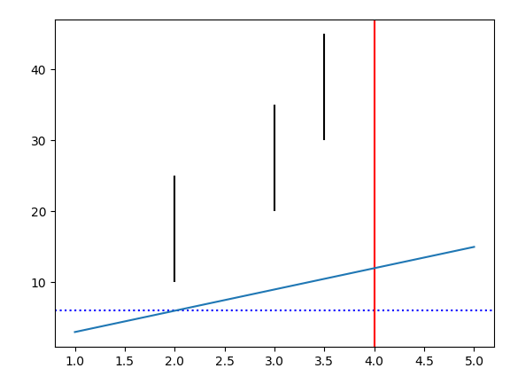

#### 2）设置线型、线宽

linestyle: 设置线型，常见取值有实线（'-'）、虚线（'--'）、点虚线（'-.'）、点线（':'）

linewidth：线宽

color：颜色（red, blue, green）

alpha: 设置透明度（0~1之间）


案例：绘制正弦、余弦曲线，并设置线型、线宽、颜色、透明度

```python
# 绘制正弦曲线
import numpy as np
import matplotlib.pyplot as mp
import math

x = np.arange(0, 2 * np.pi, 0.1)  # 以0.1为单位，生成0~6的数据
print(x)
y1 = np.sin(x)
y2 = np.cos(x)

# 绘制图形
mp.plot(x, y1, label="sin", linewidth=2)  # 实线，线宽2像素
mp.plot(x, y2, label="cos", linestyle="--", linewidth=4)  # 虚线，线宽4像素

mp.xlabel("x")  # x轴文字
mp.ylabel("y")  # y轴文字

# 设置坐标轴范围
mp.xlim(0, 2 * math.pi)
mp.ylim(-1, 2)

mp.title("sin & cos")  # 图标题
mp.legend()  # 图例
mp.show()
```

执行结果：

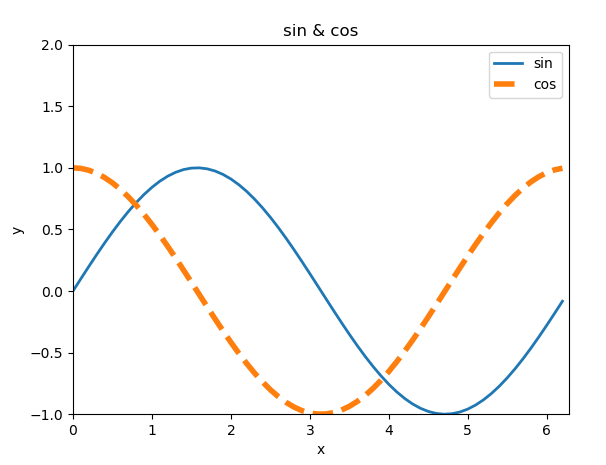

#### 3）设置坐标轴范围 

语法：

```python
#x_limt_min:	<float> x轴范围最小值
#x_limit_max:	<float> x轴范围最大值
mp.xlim(x_limt_min, x_limit_max)
#y_limt_min:	<float> y轴范围最小值
#y_limit_max:	<float> y轴范围最大值
mp.ylim(y_limt_min, y_limit_max)
```

#### 4）设置坐标刻度

语法：

```python
#x_val_list: 	x轴刻度值序列
#x_text_list:	x轴刻度标签文本序列 [可选]
mp.xticks(x_val_list , x_text_list )
#y_val_list: 	y轴刻度值序列
#y_text_list:	y轴刻度标签文本序列 [可选]
mp.yticks(y_val_list , y_text_list )
```

案例：绘制二次函数曲线

```python
# 绘制二次函数曲线
import numpy as np
import matplotlib.pyplot as mp
import math

x = np.arange(-5, 5, 0.1)  # 以0.1为单位，生成-5~5的数据
print(x)
y = x ** 2

# 绘制图形
mp.plot(x, y, label="$y = x ^ 2$",
         linewidth=2,  # 线宽2像素
         color="red",  # 颜色
         alpha=0.5)  # 透明度

mp.xlabel("x")  # x轴文字
mp.ylabel("y")  # y轴文字

# 设置坐标轴范围
mp.xlim(-10, 10)
mp.ylim(-1, 30)

# 设置刻度
x_tck = np.arange(-10, 10, 2)
x_txt = x_tck.astype("U")
mp.xticks(x_tck, x_txt)

y_tck = np.arange(-1, 30, 5)
y_txt = y_tck.astype("U")
mp.yticks(y_tck, y_txt)

mp.title("square")  # 图标题
mp.legend(loc="upper right")  # 图例 upper right, center
mp.show()
```

执行：

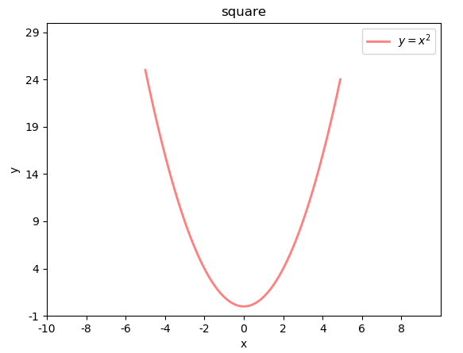

***刻度文本的特殊语法*** -- *LaTex排版语法字符串*

```python
r'$x^n+y^n=z^n$',   r'$\int\frac{1}{x} dx = \ln |x| + C$',     r'$-\frac{\pi}{2}$'
```

$$
x^n+y^n=z^n,  \int\frac{1}{x} dx = \ln |x| + C,     -\frac{\pi}{2}
$$

#### 5）设置坐标轴  

坐标轴名：left / right / bottom / top

```python
# 获取当前坐标轴字典，{'left':左轴,'right':右轴,'bottom':下轴,'top':上轴 }
ax = mp.gca()
# 获取其中某个坐标轴
axis = ax.spines['坐标轴名']
# 设置坐标轴的位置。 该方法需要传入2个元素的元组作为参数
# type: <str> 移动坐标轴的参照类型  一般为'data' (以数据的值作为移动参照值)
# val:  参照值
axis.set_position((type, val))
# 设置坐标轴的颜色
# color: <str> 颜色值字符串
axis.set_color(color)
```

案例：设置坐标轴格式

```python
# 设置坐标轴
import matplotlib.pyplot as mp

ax = mp.gca()
axis_b = ax.spines['bottom']  # 获取下轴
axis_b.set_position(('data', 0))  # 设置下轴位置, 以数据作为参照值

axis_l = ax.spines['left']  # 获取左轴
axis_l.set_position(('data', 0))  # 设置左轴位置, 以数据作为参照值

ax.spines['top'].set_color('none')  # 设置顶部轴无色
ax.spines['right'].set_color('none')  # 设置右部轴无色

mp.show()
```

执行结果：

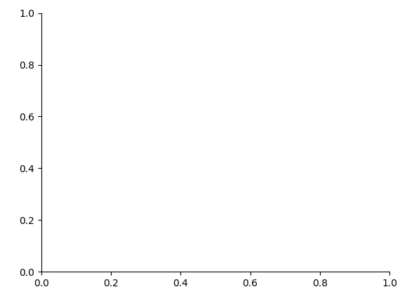

#### 6）图例

显示两条曲线的图例，并测试loc属性。

```python
# 再绘制曲线时定义曲线的label
# label: <关键字参数 str> 支持LaTex排版语法字符串
mp.plot(xarray, yarray ... label='', ...)
# 设置图例的位置
# loc: <关键字参数> 制定图例的显示位置 (若不设置loc，则显示默认位置)
#	 ===============   =============
#    Location String   Location Code
#    ===============   =============
#    'best'            0
#    'upper right'     1
#    'upper left'      2
#    'lower left'      3
#    'lower right'     4
#    'right'           5
#    'center left'     6
#    'center right'    7
#    'lower center'    8
#    'upper center'    9
#    'center'          10
#    ===============   =============
mp.legend(loc='')
```

#### 7）特殊点

语法：

```python
# xarray: <序列> 所有需要标注点的水平坐标组成的序列
# yarray: <序列> 所有需要标注点的垂直坐标组成的序列
mp.scatter(xarray, yarray, 
           marker='', 		#点型 ~ matplotlib.markers
           s='', 			#大小
           edgecolor='', 	#边缘色
           facecolor='',	#填充色
           zorder=3			#绘制图层编号 （编号越大，图层越靠上）
)

```

示例：在二次函数图像中添加特殊点

```python
# 绘制特殊点
mp.scatter(x_tck,  # x坐标数组
            x_tck ** 2,  # y坐标数组
            marker="s",  # 点形状 s:square
            s=40,  # 大小
            facecolor="blue",  # 填充色
            zorder=3)  # 图层编号
```

执行结果：

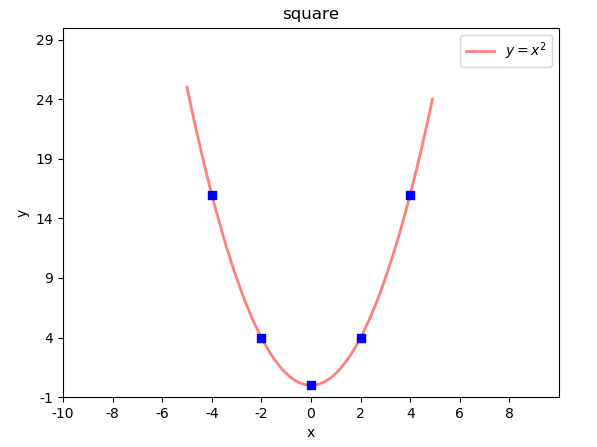

*marker点型可参照：help(matplotlib.markers)*

*也可参照附录： matplotlib point样式*

### 2. 图形对象（图形窗口）

语法：绘制两个窗口，一起显示。

```python
# 手动构建 matplotlib 窗口
mp.figure(
    'sub-fig',					#窗口标题栏文本 
    figsize=(4, 3),		#窗口大小 <元组>
	facecolor=''		#图表背景色
)
mp.show()
```

mp.figure方法不仅可以构建一个新窗口，如果已经构建过title='xxx'的窗口，又使用figure方法构建了title='xxx' 的窗口的话，mp将不会创建新的窗口，而是把title='xxx'的窗口置为当前操作窗口。

**设置当前窗口的参数**

语法：测试窗口相关参数

```python
# 设置图表标题 显示在图表上方
mp.title(title, fontsize=12)
# 设置水平轴的文本
mp.xlabel(x_label_str, fontsize=12)
# 设置垂直轴的文本
mp.ylabel(y_label_str, fontsize=12)
# 设置刻度参数   labelsize设置刻度字体大小
mp.tick_params(..., labelsize=8, ...)
# 设置图表网格线  linestyle设置网格线的样式
	#	-  or solid 粗线
	#   -- or dashed 虚线
	#   -. or dashdot 点虚线
	#   :  or dotted 点线
mp.grid(linestyle='')
# 设置紧凑布局，把图表相关参数都显示在窗口中
mp.tight_layout() 

```

示例：绘制两个图像窗口

```python
# 绘制两个图像窗口
import matplotlib.pyplot as mp

mp.figure("FigureA", facecolor="lightgray")
mp.grid(linestyle="-.")  # 设置网格线

mp.figure("FigureB", facecolor="gray")
mp.xlabel("Date", fontsize=14)
mp.ylabel("Price", fontsize=14)
mp.grid(linestyle="--")  # 设置网格线
mp.tight_layout()  # 设置紧凑布局

mp.show()
```

执行结果：

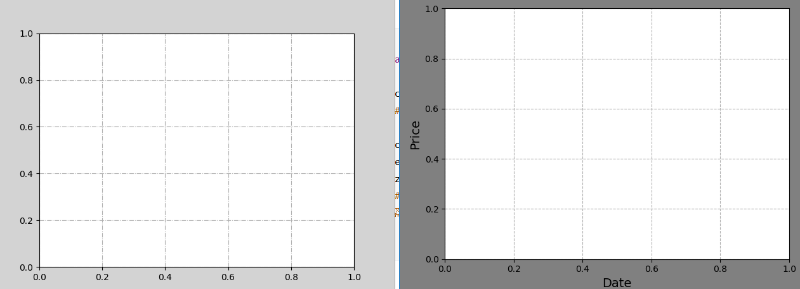

#### 1）子图

**矩阵式布局**

绘制矩阵式子图布局相关API：

```python
mp.figure('Subplot Layout', facecolor='lightgray')
# 拆分矩阵
	# rows:	行数
    # cols:	列数
    # num:	编号
mp.subplot(rows, cols, num)
	#	1 2 3
	#	4 5 6
	#	7 8 9 
mp.subplot(3, 3, 5)		#操作3*3的矩阵中编号为5的子图
mp.subplot(335)			#简写

```

案例：绘制9宫格矩阵式子图，每个子图中写一个数字。

```python
mp.figure('Subplot Layout', facecolor='lightgray')

for i in range(9):
	mp.subplot(3, 3, i+1)
	mp.text(
		0.5, 0.5, i+1, 
		ha='center',
		va='center',
		size=36,
		alpha=0.5,
		withdash=False
	)
	mp.xticks([])
	mp.yticks([])

mp.tight_layout()
mp.show()

```

执行结果：

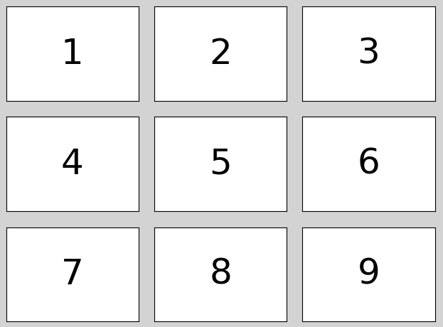

网格式布局(很少使用)**

网格式布局支持单元格的合并。

绘制网格式子图布局相关API：

```python
import matplotlib.gridspec as mg
mp.figure('Grid Layout', facecolor='lightgray')
# 调用GridSpec方法拆分网格式布局
# rows:	行数
# cols:	列数
# gs = mg.GridSpec(rows, cols)	拆分成3行3列
gs = mg.GridSpec(3, 3)	
# 合并0行与0、1列为一个子图表
mp.subplot(gs[0, :2])
mp.text(0.5, 0.5, '1', ha='center', va='center', size=36)
mp.show()

```

案例：绘制一个自定义网格布局。

```python
import matplotlib.gridspec as mg
mp.figure('GridLayout', facecolor='lightgray')
gridsubs = mp.GridSpec(3, 3)
# 合并0行、0/1列为一个子图
mp.subplot(gridsubs[0, :2])
mp.text(0.5, 0.5, 1, ha='center', va='center', size=36)
mp.tight_layout()
mp.xticks([])
mp.yticks([])

```

**自由式布局(很少使用)**

自由式布局相关API：

```python
mp.figure('Flow Layout', facecolor='lightgray')
# 设置图标的位置，给出左下角点坐标与宽高即可
# left_bottom_x: 坐下角点x坐标
# left_bottom_x: 坐下角点y坐标
# width:		 宽度
# height:		 高度
# mp.axes([left_bottom_x, left_bottom_y, width, height])
mp.axes([0.03, 0.03, 0.94, 0.94])
mp.text(0.5, 0.5, '1', ha='center', va='center', size=36)
mp.show()

```

案例：测试自由式布局，定位子图。

```python
mp.figure('FlowLayout', facecolor='lightgray')

mp.axes([0.1, 0.2, 0.5, 0.3])
mp.text(0.5, 0.5, 1, ha='center', va='center', size=36)
mp.show()

```

#### 2）刻度定位器

刻度定位器相关API：

```python
# 获取当前坐标轴
ax = mp.gca()
# 设置水平坐标轴的主刻度（显示字的刻度）定位器
ax.xaxis.set_major_locator(mp.NullLocator())
# 设置水平坐标轴的次刻度（不显示字的刻度）定位器为多点定位器，间隔0.1
ax.xaxis.set_minor_locator(mp.MultipleLocator(0.1))

```

案例：绘制一个数轴，每隔1一个主刻度，每隔0.1一个次刻度。

```python
import matplotlib.pyplot as mp

mp.figure('Locators', facecolor='lightgray')
# 获取当前坐标轴
ax = mp.gca()

# 隐藏除底轴以外的所有坐标轴
ax.spines['left'].set_color('none')
ax.spines['top'].set_color('none')
ax.spines['right'].set_color('none')

# 将底坐标轴调整到子图中心位置
ax.spines['bottom'].set_position(('data', 0))
# 设置水平坐标轴的主刻度定位器
ax.xaxis.set_major_locator(mp.MultipleLocator(1))
# 设置水平坐标轴的次刻度定位器为多点定位器，间隔0.1
ax.xaxis.set_minor_locator(mp.MultipleLocator(0.1))

mp.xlim(1, 5)
# 标记所用刻度定位器类名
mp.text(5, 0.3, 'NullLocator()', ha='center', size=12)

mp.show()
```

执行结果：

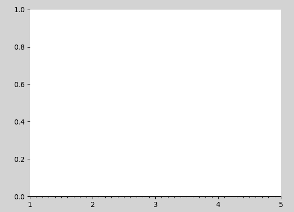

常用刻度器如下：

```python
# 空定位器：不绘制刻度
mp.NullLocator()
# 最大值定位器：
# 最多绘制nbins+1个刻度
mp.MaxNLocator(nbins=3)
# 定点定位器：根据locs参数中的位置绘制刻度
mp.FixedLocator(locs=[0, 2.5, 5, 7.5, 10])
# 自动定位器：由系统自动选择刻度的绘制位置
mp.AutoLocator()
# 索引定位器：由offset确定起始刻度，由base确定相邻刻度的间隔
mp.IndexLocator(offset=0.5, base=1.5)
# 多点定位器：从0开始，按照参数指定的间隔(缺省1)绘制刻度
mp.MultipleLocator()
# 线性定位器：等分numticks-1份，绘制numticks个刻度
mp.LinearLocator(numticks=21)
# 对数定位器：以base为底，绘制刻度
mp.LogLocator(base=2)
```


案例：使用for循环测试刻度器样式：

```python
import matplotlib.pyplot as mp
import numpy as np

locators = ['mp.NullLocator()', # 空刻度定位器，不绘制刻度
            'mp.MultipleLocator(1)', # 多点定位器：从0开始，按照参数指定的间隔(缺省1)绘制
            'mp.MaxNLocator(nbins=4)',# 最多绘制指定个数+1个主刻度
            'mp.AutoLocator()'] # 自动定位器：由系统自动选择刻度的绘制位置

for i, locator in enumerate(locators):
    mp.subplot(len(locators), 1, i + 1)
    mp.xlim(0, 10)
    mp.ylim(-1, 1)
    mp.yticks([])
    # 获取当前坐标轴
    ax = mp.gca()
    # 隐藏除底轴以外的所有坐标轴
    ax.spines['left'].set_color('none')
    ax.spines['top'].set_color('none')
    ax.spines['right'].set_color('none')
    # 将底坐标轴调整到子图中心位置
    ax.spines['bottom'].set_position(('data', 0))
    # 设置水平坐标轴的主刻度定位器
    ax.xaxis.set_major_locator(eval(locator))
    # 设置水平坐标轴的次刻度定位器为多点定位器，间隔0.1
    ax.xaxis.set_minor_locator(mp.MultipleLocator(0.1))
    mp.plot(np.arange(11), np.zeros(11), c='none')
    # 标记所用刻度定位器类名
    mp.text(5, 0.3, locator, ha='center', size=12)

mp.show()
```

执行结果：

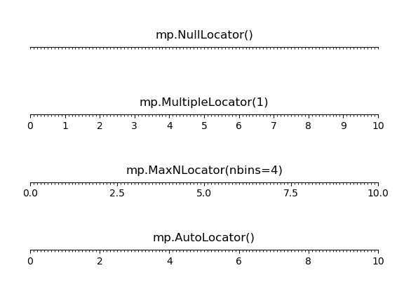

#### 3）刻度网格线

绘制刻度网格线的相关API：

```python
ax = mp.gca()
#绘制刻度网格线
ax.grid(
    which='',		# 'major'/'minor' <-> '主刻度'/'次刻度' 
    axis='',		# 'x'/'y'/'both' <-> 绘制x或y轴
    linewidth=1, 	# 线宽
    linestyle='', 	# 线型
    color='',		# 颜色
	alpha=0.5		# 透明度
)
```

案例：绘制曲线 [1, 10, 100, 1000, 100, 10, 1]，然后设置刻度网格线，测试刻度网格线的参数。

```python
import matplotlib.pyplot as mp
import numpy as np

y = np.array([1, 10, 100, 1000, 100, 10, 1]) # 数据

mp.figure('Normal & Log', facecolor='lightgray')
mp.subplot(211) #2行1列中的第1个子图
mp.title('Normal', fontsize=20)
mp.ylabel('y', fontsize=14)

ax = mp.gca() # 获取当前图形的坐标轴对象
# 设置x,y方向主刻度、次刻度
ax.xaxis.set_major_locator(mp.MultipleLocator(1.0))
ax.xaxis.set_minor_locator(mp.MultipleLocator(0.1))

ax.yaxis.set_major_locator(mp.MultipleLocator(250))
ax.yaxis.set_minor_locator(mp.MultipleLocator(50))


ax.grid(which='major', axis='both', linewidth=0.75,
        linestyle='-', color='orange') #主刻度网格线，axis还可以取x,y
ax.grid(which='minor', axis='both', linewidth=0.25,
        linestyle='-', color='orange') #次刻度网格线

mp.plot(y, 'o-', c='blue', label='plot')
mp.legend()
mp.show()
```

执行结果：

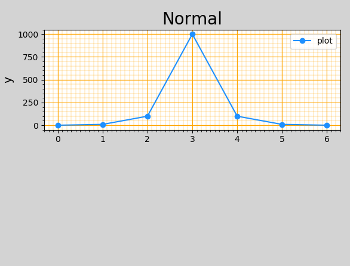

#### 4）半对数坐标 

##### ① 算术坐标

就是普通的笛卡儿坐标，横纵的刻度都是等距的（举例来说：如果每1cm的长度都代表2，则刻度按照顺序0，2，4，6，8，10，12，14……）。

##### ② 对数坐标

坐标轴是按照相等的指数变化来增加的（举例来说：如果每1cm代表10的1次方增加，则坐标轴刻度依次为1，10，100，1000，10000……）。

##### ③ 半对数坐标

只有一个坐标轴是对数坐标，另一个是普通算术坐标。

##### ④ 案例

绘制半对数坐标，y轴将以指数方式递增。 基于半对数坐标绘制第二个子图，表示曲线：[1, 10, 100, 1000, 100, 10, 1]。

```python
# 半对数坐标示例
import matplotlib.pyplot as mp
import numpy as np

mp.figure('Grid', facecolor='lightgray')
y = [1, 10, 100, 1000, 100, 10, 1]
mp.semilogy(y)
mp.show()
```

执行结果：

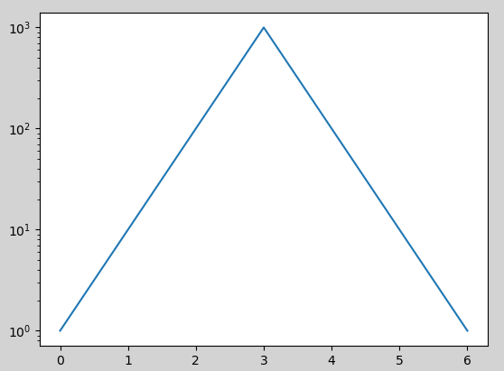

#### 5）散点图

可以通过每个点的坐标、颜色、大小和形状表示不同的特征值。

| 身高 | 体重 | 性别 | 年龄段 | 种族 |
| ---- | ---- | ---- | ------ | ---- |
| 180  | 80   | 男   | 中年   | 亚洲 |
| 160  | 50   | 女   | 青少   | 美洲 |

绘制散点图的相关API：

```python
mp.scatter(
    x, 					# x轴坐标数组
    y,					# y轴坐标数组
    marker='', 			# 点型
    s=10,				# 大小
    color='',			# 颜色
    edgecolor='', 		# 边缘颜色
    facecolor='',		# 填充色
    zorder=''			# 图层序号
)

```

numpy.random提供了normal函数用于产生符合 正态分布 的随机数 

```python
n = 100
# 172:	期望值
# 10:	标准差
# n:	数字生成数量
x = np.random.normal(172, 20, n)
y = np.random.normal(60, 10, n)

```

案例：绘制平面散点图。

```python
# 散点图示例
import matplotlib.pyplot as mp
import numpy as np

n = 40
# 期望值：期望值是该变量输出值的平均数
# 标准差：是反映一组数据离散程度最常用的一种量化形式，是表示精确度的重要指标
x = np.random.normal(172, 20 ,n ) # 期望值, 标准差, 生成数量
y = np.random.normal(60, 10, n) # 期望值, 标准差, 生成数量

x2 = np.random.normal(180, 20 ,n ) # 期望值, 标准差, 生成数量
y2 = np.random.normal(70, 10, n) # 期望值, 标准差, 生成数量

mp.figure("scatter", facecolor="lightgray")
mp.title("Scatter Demo")
mp.scatter(x, y, c="red", marker="D")
mp.scatter(x2, y2, c="blue", marker="v")

mp.xlim(100, 240)
mp.ylim(0, 100)
mp.show()
```

执行结果：

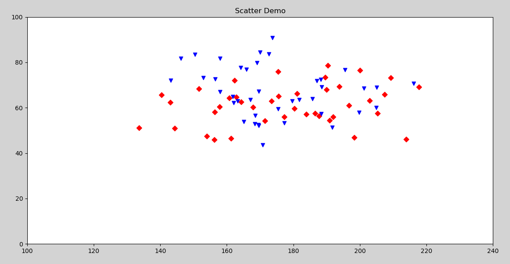

*cmap颜色映射表参照附件：cmap颜色映射表*

#### 6）填充

以某种颜色自动填充两条曲线的闭合区域。

```python
mp.fill_between(
	x,				# x轴的水平坐标
    sin_x,			# 下边界曲线上点的垂直坐标
    cos_x,			# 上边界曲线上点的垂直坐标
    sin_x<cos_x, 	# 填充条件，为True时填充
    color='', 		# 填充颜色
    alpha=0.2		# 透明度
)
```

案例：绘制两条曲线： sin_x = sin(x)    cos_x = cos(x / 2) / 2	[0-8π]  

```python
import matplotlib.pyplot as mp
import numpy as np

n = 1000
x = np.linspace(0, 8 * np.pi, n)  # 返回指定间隔上的等距数字

sin_y = np.sin(x)  # 计算sin函数值
cos_y = np.cos(x / 2) / 2  # 计算cos函数值

mp.figure('Fill', facecolor='lightgray')
mp.title('Fill', fontsize=20)
mp.xlabel('x', fontsize=14)  # x轴标签
mp.ylabel('y', fontsize=14)  # y轴
mp.tick_params(labelsize=10)  # 刻度
mp.grid(linestyle=':')

mp.plot(x, sin_y, c='dodgerblue', label=r'$y=sin(x)$')
mp.plot(x, cos_y, c='orangered', label=r'$y=\frac{1}{2}cos(\frac{x}{2})$')

# 填充cos_y < sin_y的部分
mp.fill_between(x, cos_y, sin_y, cos_y < sin_y, color='dodgerblue', alpha=0.5)
# 填充cos_y > sin_y的部分
mp.fill_between(x, cos_y, sin_y, cos_y > sin_y, color='orangered', alpha=0.5)

mp.legend()
mp.show()
```

执行结果：

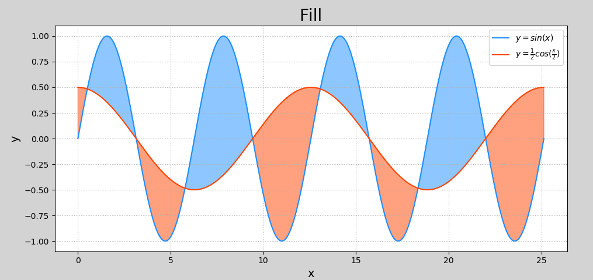

#### 7）条形图（柱状图）

绘制柱状图的相关API：

```python
mp.figure('Bar', facecolor='lightgray')
mp.bar(
	x,				# 水平坐标数组
    y,				# 柱状图高度数组
    width,			# 柱子的宽度
    color='', 		# 填充颜色
    label='',		#
    alpha=0.2		#
)
```

案例：先以柱状图绘制苹果12个月的销量，然后再绘制橘子的销量。

```python
import matplotlib.pyplot as mp
import numpy as np

apples = np.array([30, 25, 22, 36, 21, 29, 20, 24, 33, 19, 27, 15])
oranges = np.array([24, 33, 19, 27, 35, 20, 15, 27, 20, 32, 20, 22])

mp.figure('Bar', facecolor='lightgray')
mp.title('Bar', fontsize=20)
mp.xlabel('Month', fontsize=14)
mp.ylabel('Price', fontsize=14)
mp.tick_params(labelsize=10)
mp.grid(axis='y', linestyle=':')
mp.ylim((0, 40))

x = np.arange(len(apples))  # 产生均匀数组，长度等同于apples

mp.bar(x - 0.2,  # 横轴数据
       apples,  # 纵轴数据
       0.4,  # 柱体宽度
       color='dodgerblue',
       label='Apple')
mp.bar(x + 0.2,  # 横轴数据
       oranges,  # 纵轴数据
       0.4,  # 柱体宽度
       color='orangered', label='Orange', alpha=0.75)

mp.xticks(x, ['Jan', 'Feb', 'Mar', 'Apr', 'May', 'Jun', 'Jul', 'Aug', 'Sep', 'Oct', 'Nov', 'Dec'])

mp.legend()
mp.show()
```

#### 8）饼图

绘制饼状图的基本API：

```python
mp.pie(
    values, 		# 值列表		
    spaces, 		# 扇形之间的间距列表
    labels, 		# 标签列表
    colors, 		# 颜色列表
    '%d%%',			# 标签所占比例格式
	shadow=True, 	# 是否显示阴影
    startangle=90	# 逆时针绘制饼状图时的起始角度
    radius=1		# 半径
)
```

案例：绘制饼状图显示6门编程语言的流行程度：

```python
import matplotlib.pyplot as mp
import numpy as np

mp.figure('pie', facecolor='lightgray')
mp.title('Pie', fontsize=20)
# 整理数据
values = [15, 13.3, 8.5, 7.3, 4.62, 51.28]
spaces = [0.05, 0.01, 0.01, 0.01, 0.01, 0.01]
labels = ['Java', 'C', 'Python', 'C++', 'VB', 'Other']
colors = ['dodgerblue', 'orangered', 'limegreen', 'violet', 'gold','blue']
# 等轴比例
mp.axis('equal')
mp.pie(
    values,  # 值列表
    spaces,  # 扇形之间的间距列表
    labels,  # 标签列表
    colors,  # 颜色列表
    '%d%%',  # 标签所占比例格式
    shadow=True,  # 是否显示阴影
    startangle=90,  # 逆时针绘制饼状图时的起始角度
    radius=1  # 半径
)
mp.legend()
mp.show()
```

执行结果：

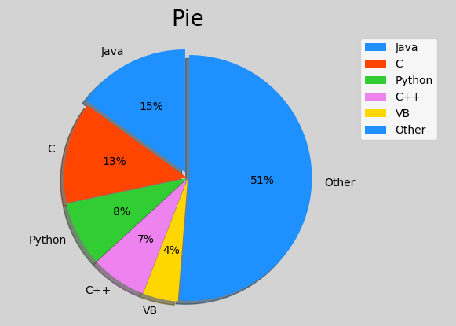

#### 9）等高线图

##### ① API介绍

组成等高线需要网格点坐标矩阵，也需要每个点的高度。所以等高线属于3D数学模型范畴。

绘制等高线的相关API：

```python
mp.contourf(x, y, z, 8, cmap='jet')
cntr = mp.contour(
    x, 					# 网格坐标矩阵的x坐标 （2维数组）
    y, 					# 网格坐标矩阵的y坐标 （2维数组）
    z, 					# 网格坐标矩阵的z坐标 （2维数组）
    8, 					# 把等高线绘制成8部分
    colors='black',		# 等高线的颜色
	linewidths=0.5		# 线宽
)
```

##### ② 坐标矩阵

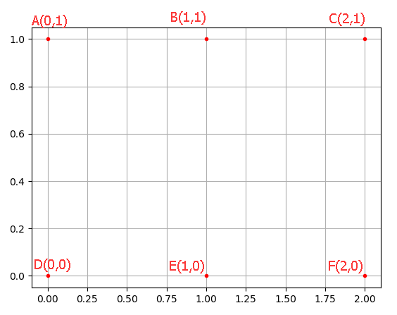

将上面的点使用矩阵表示为：
$$
X = 
\left[
\begin{matrix}
0 & 1 & 2 \\
0 & 1 & 2 \\
\end{matrix} \right]\tag{2}\\
$$

$$
Y = 
\left[
\begin{matrix}
1 & 1 & 1 \\
0 & 0 & 0 \\
\end{matrix} \right]\tag{2}
$$

这就是坐标矩阵。

##### ③ 案例

生成网格坐标矩阵，并且绘制等高线：

```python
import matplotlib.pyplot as mp
import numpy as np

n = 1000
# 生成网格化坐标矩阵
x, y = np.meshgrid(np.linspace(-3, 3, n), np.linspace(-3, 3, n))

# 根据每个网格点坐标，通过某个公式计算z高度坐标
z = (1 - x / 2 + x ** 5 + y ** 3) * np.exp(-x ** 2 - y ** 2)

mp.figure('Contour', facecolor='lightgray')
mp.title('Contour', fontsize=20)
mp.xlabel('x', fontsize=14)
mp.ylabel('y', fontsize=14)
mp.tick_params(labelsize=10)
mp.grid(linestyle=':')

# 绘制等高线图
mp.contourf(x, y, z, 12, cmap='jet') #创建三维等高线图
cntr = mp.contour(x, y, z, 12, colors='black', linewidths=0.5) #绘制

# 为等高线图添加高度标签
mp.clabel(cntr, inline_spacing=1, fmt='%.1f', fontsize=10)
mp.show()
```

执行结果：

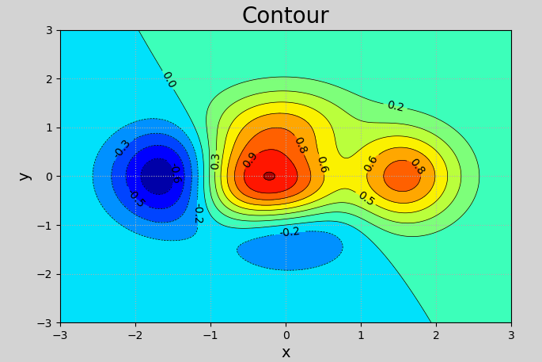

#### 10）热成像图

原理：用图形的方式显示矩阵及矩阵中值的大小
1 2 3
4 5 6
7 8 9

绘制热成像图的相关API：

```python
# 把矩阵z图形化，使用cmap表示矩阵中每个元素值的大小
# origin: 坐标轴方向
#    upper: 缺省值，原点在左上角
#    lower: 原点在左下角
mp.imshow(z, cmap='jet', origin='low')
```

使用颜色条显示热度值：

```python
mp.colorbar()
```

示例：绘制热成像图

```python
# 热成像图示例
import numpy as np
import matplotlib.pyplot as mp

# 生成数据
n = 500
x, y = np.meshgrid(np.linspace(-3, 3, n), np.linspace(-3, 3, n))
z = (1 - x / 2 + x ** 5 + y ** 3) * np.exp(-x ** 2 - y ** 2)

mp.figure('ColorBar', facecolor='lightgray') #ColorBar:热成像图
mp.title('ColorBar')
mp.grid(linestyle=":")
mp.imshow(z, cmap='jet', origin='low')
mp.colorbar() #显示边条
mp.show()
```

执行结果：

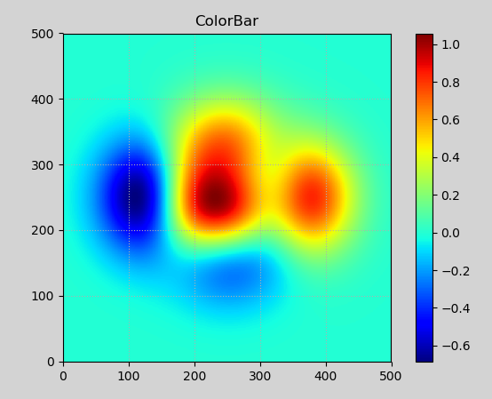

#### 11）3D图像绘制

##### ① API介绍

 matplotlib支持绘制三维曲面。若希望绘制三维曲面，需要使用axes3d提供的3d坐标系。

```python
from mpl_toolkits.mplot3d import axes3d
ax3d = mp.gca(projection='3d')   # class axes3d
```

matplotlib支持绘制三维点阵、三维曲面、三维线框图：

```python
ax3d.scatter(..)		# 绘制三维点阵
ax3d.plot_surface(..)	# 绘制三维曲面
ax3d.plot_wireframe(..)	# 绘制三维线框图
```

3d散点图的绘制相关API：

```python
ax3d.scatter(
    xs, 			# x轴坐标数组
    ys,				# y轴坐标数组
    zs=0,			# z轴坐标数组
    marker='', 		# 点型
    s=10,			# 大小
    zorder='',		# 图层序号
    color='',		# 颜色
    edgecolor='', 	# 边缘颜色
    facecolor='',	# 填充色
    c=v,			# 颜色值 根据cmap映射应用相应颜色
    cmap=''			# 
)
```

##### ② 案例

随机生成3组坐标，程标准正态分布规则，并且绘制它们。

```python
# 绘制3D图
import numpy as np
import matplotlib.pyplot as mp
from mpl_toolkits.mplot3d import Axes3D

# 产生数据
n = 100
x = np.random.normal(0, 1, n)
y = np.random.normal(0, 1, n)
z = np.random.normal(0, 1, n)

d = np.sqrt(x ** 2 + y ** 2 + z ** 2) #计算颜色
mp.figure('3D Scatter')
ax = mp.gca(projection='3d')  # 创建三维坐标系
mp.title('3D Scatter', fontsize=20)
ax.set_xlabel('x', fontsize=14)
ax.set_ylabel('y', fontsize=14)
ax.set_zlabel('z', fontsize=14)
mp.tick_params(labelsize=10)

ax.scatter(x, y, z,
           s=80, #大小
           c=d, #颜色
           cmap='jet_r', #色彩反向映射
           alpha=0.5)
mp.show()
```

执行结果：

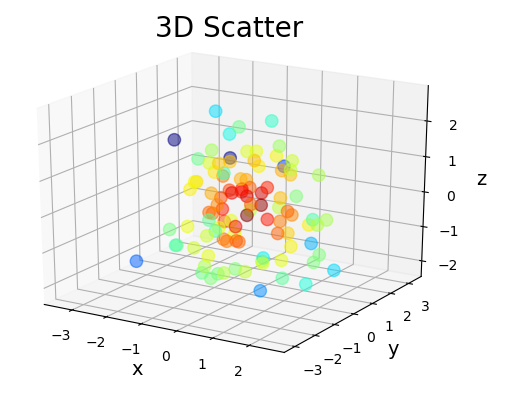

3d平面图的绘制相关API：

```python
ax3d.plot_surface(
    x, 					# 网格坐标矩阵的x坐标 （2维数组）
    y, 					# 网格坐标矩阵的y坐标 （2维数组）
    z, 					# 网格坐标矩阵的z坐标 （2维数组）
    rstride=30,			# 行跨距
    cstride=30, 		# 列跨距
    cmap='jet'			# 颜色映射
)
```

案例：绘制3d平面图

```python
# 绘制3D平面图
import numpy as np
import matplotlib.pyplot as mp
from mpl_toolkits.mplot3d import Axes3D

n = 1000
# 生成网格化坐标矩阵
x, y = np.meshgrid(np.linspace(-3, 3, n), np.linspace(-3, 3, n))
# 根据每个网格点坐标，通过某个公式计算z高度坐标
z = (1 - x / 2 + x ** 5 + y ** 3) * np.exp(-x ** 2 - y ** 2)
mp.figure('3D', facecolor='lightgray')

ax3d = mp.gca(projection='3d')
mp.title('3D Surface', fontsize=18)
ax3d.set_xlabel('x', fontsize=14)
ax3d.set_ylabel('y', fontsize=14)
ax3d.set_zlabel('z', fontsize=14)
mp.tick_params(labelsize=10)
# 绘制3D平面图
# rstride: 行跨距
# cstride: 列跨距
ax3d.plot_surface(x, y, z, rstride=30, cstride=30, cmap='jet')

mp.show()
```

执行结果：

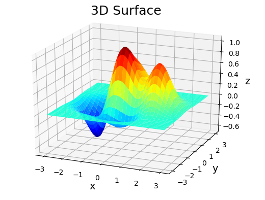

案例：3d线框图的绘制（将案例中的调用plot_surface函数一行换成下面的代码）

```python
# 绘制3D平面图 
# rstride: 行跨距
# cstride: 列跨距 
ax3d.plot_wireframe(x,y,z,rstride=30,cstride=30, 
	linewidth=1, color='dodgerblue')
```

执行结果：

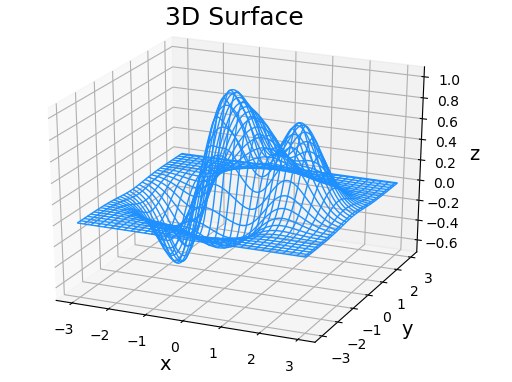


## 二、综合实例

### 1. 绘制股票K线图

```python
# 读取文本文件示例
# 绘制K线
# 求算数平均值并绘制均值曲线
import numpy as np
import datetime as dt


#### 1.读取数据
# 日期格式转换函数: 将日月年转换为年月日格式
def dmy2ymd(dmy):
    dmy = str(dmy, encoding="utf-8")
    # 从指定字符串返回一个日期时间对象
    dat = dt.datetime.strptime(dmy, "%d-%m-%Y").date()  # 字符串转日期
    tm = dat.strftime("%Y-%m-%d")  # 日期转字符串
    return tm


dates, open_prices, highest_prices, lowest_prices, close_prices = \
    np.loadtxt("../da_data/appl.csv",  # 文件路径
               delimiter=",",  # 指定分隔符
               usecols=(1, 3, 4, 5, 6),  # 读取的列(下标从0开始)
               unpack=True,  # 拆分数据
               dtype="M8[D], f8, f8, f8, f8",  # 指定每一列的类型
               converters={1: dmy2ymd})  #
print(dates)
print(open_prices)
print(highest_prices)
print(lowest_prices)
print(close_prices)

#### 2.绘制图像
import matplotlib.pyplot as mp
import matplotlib.dates as md

# 绘制k线图，x轴为日期
mp.figure("APPL K-Line")
mp.title("APPL K-Line")
mp.xlabel("Day", fontsize=12)
mp.ylabel("Price", fontsize=12)

# 获取坐标轴
ax = mp.gca()
# 设置主刻度定位器为周定位器(每周一显示刻度文本)
ax.xaxis.set_major_locator(md.WeekdayLocator(byweekday=md.MO))
ax.xaxis.set_major_formatter(md.DateFormatter("%d %b %Y"))  # %b表示月份简写
# 设置次刻度定位器为天定位器
ax.xaxis.set_minor_locator(md.DayLocator())
mp.tick_params(labelsize=8)
dates = dates.astype(md.datetime.datetime)

mp.plot(dates, open_prices, color="dodgerblue", linestyle="--")
mp.gcf().autofmt_xdate()  # 旋转、共享日期显示

#### 3.绘制蜡烛图
rise = close_prices >= open_prices  # rise为布尔类型构成列表
color = np.array([("red" if x else "green") for x in rise])
color[rise] = "white"
# 边框颜色
edge_color = ["red" if x else "green" for x in rise]

# 绘制线条
mp.bar(dates,  # x轴
       highest_prices - lowest_prices,  # 区间：最高价-最低价
       0.1,  # 宽度
       lowest_prices,  # 底部坐标
       color=edge_color)
# 绘制方块
mp.bar(dates,  # x轴
       close_prices - open_prices,  # 区间：收盘价-开盘价
       0.8,  # 宽度
       open_prices,  # 底部坐标
       color=color, # 颜色
       edgecolor=edge_color, #边框颜色
       zorder=3)

#### 4. 求股票价格算数平均值，并绘制线条
mean = np.mean(close_prices)
mp.hlines(mean, dates[0], dates[-1], color="blue", linestyles=":", label="Mean")

# 绘制5日均值线
ma_5 = np.zeros(close_prices.size - 4)  # 均值数组
for i in range(ma_5.size):
    ma_5[i] = close_prices[i: i + 5].mean()  # 切片，求均值，并存入均值数组

mp.plot(dates[4:],  # 从第五天开始绘制
        ma_5,  # 数据
        color="orangered",
        label="MA_5")

mp.grid()
mp.legend()
mp.show()
```


